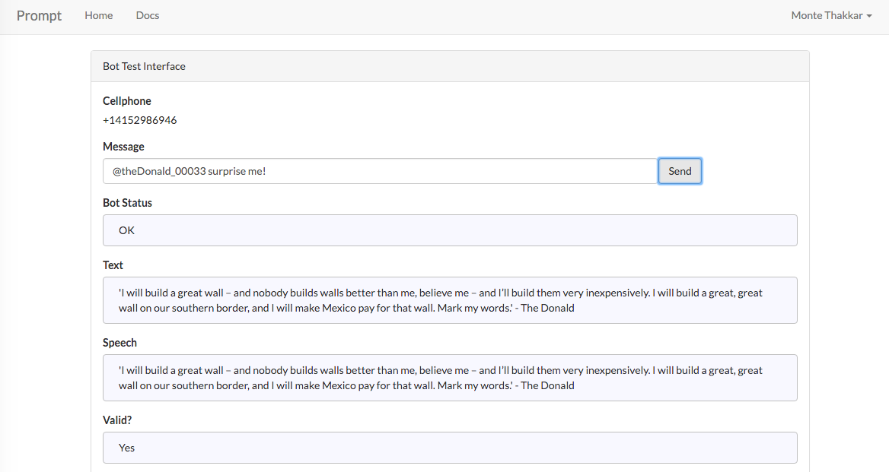

# TheDonald -- [Prompt App](www.promptapp.io) bot 

#What this bot does

TheDonald is a simple [Prompt App](www.promptapp.io) bot written in Node.js+jQuery that spits out the most outrageous statements said by future President Donald J Trump. NOT!!! This bot receieves a message from an SMS text/ Slack/ Prompt website and returns a new Donald Trump quote message to the user.

Ex: ```@trump_00033 say a quote```

Response: ```'I think the only difference between me and the other candidates is that I’m more honest and my women are more beautiful.' - TheDonald```

# Testing it out

Head over to the [Prompt Developer Test Interface](http://developer.promptapp.io/testinterface) and enter the command:



# Notes

Built at HackTech16. 

Credit to  for the boiler plate project that can be found here: https://github.com/PeterKaminski09/NodePromptManager


