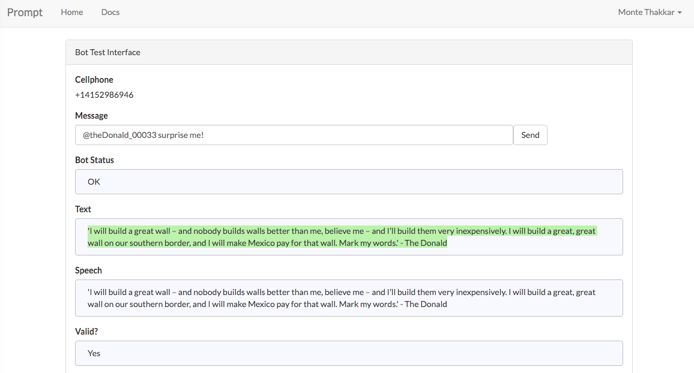

# TrumpedOut -- [Prompt App](www.promptapp.io) bot

#What this bot does

TrumpedOut is a simple [Prompt App](www.promptapp.io) bot written in with Nodejs+jQuery that spits out the most outrageous tweets said by future President Donald J Trump. NOT!!! If you're not familiar with Prompt; this bot receieves a message from an SMS text/ Slack/ Prompt website and returns a new Donald Trump quote message to the user.

Ex: ```@trump_00033 say a quote```

Response: ```"I will build a great wall – and nobody builds walls better than me, believe me – and I’ll build them very inexpensively. I will build a great, great wall on our southern border, and I will make Mexico pay for that wall. Mark my words."```

# Testing it out

Head over to the test interface on [http://promptapp.io/](http://promptapp.io/) to enter the command:



# Notes

Built at HackTech16. 

Credit to  for the boiler plate project that can be found here: https://github.com/PeterKaminski09/NodePromptManager


